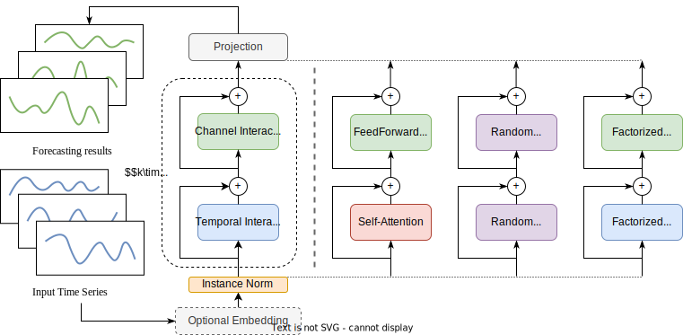
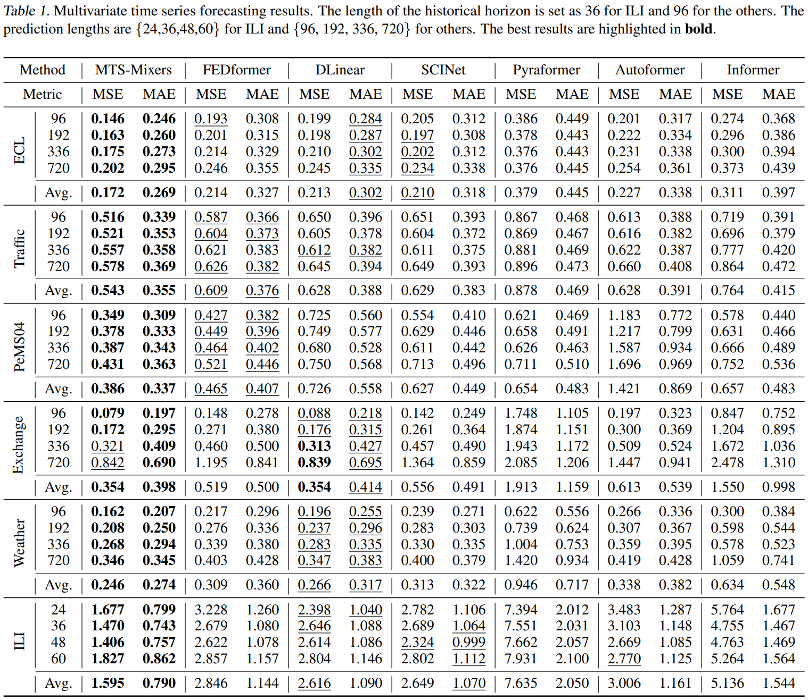
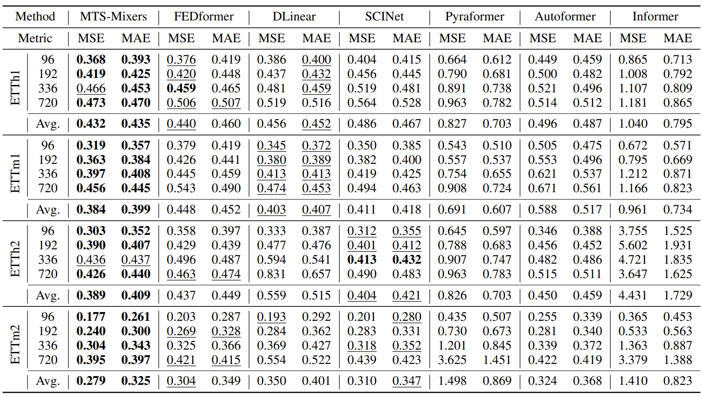

# MTS-Mixers
This is an official implementation of MTS-Mixers: Multivariate Time Series Forecasting via Factorized Temporal and Channel Mixing. [[paper](https://arxiv.org/abs/2302.04501)]

## Key Designs
**1. Overall Framework**



The architecture of MTS-Mixers comprises modules in a dashed box which defines a general framework with k-stacked blocks for capturing temporal and channel interaction. Three specific implementations are presented, which utilize attention, random matrix, or factorized MLP to capture temporal and channel dependencies. An optional input embedding is included for positional or date-specific encoding, and the instance normalization refers to [RevIN](https://openreview.net/pdf?id=cGDAkQo1C0p).

**2. Temporal Factorization**

Inspired by the fact that the original sequence and the down-sampled sequence may maintain the same temporal characteristics, we apply down-sampling to alleviate the temporal redundancy for better utilizing point-wise dependency as

$$\mathcal{X}_{T,i}=\hat{\mathcal{X}_T}[i::s, :],\quad0\leq i<s,$$

$$\mathcal{X}_T=\mathsf{merge}(\mathcal{X}_{T,0},\mathcal{X}_{T,1},\dots,\mathcal{X}_{T,s-1}),$$

where $s$ denotes the number of down-sampled subsequences and $[\cdot]$ indicates a slice operation. $\mathsf{merge}(\cdot)$ means we merge the $s$  interleaved subsequences $\mathcal{X}_{T,i}\in\mathbb{R}^{\frac{n}{s}\times c}$ into $\mathcal{X}_T\in\mathbb{R}^{n\times c}$ according to the original order for each point. Here we present an example of temporal factorization when $s=2$.


**3. Channel Factorization**

From the perspective of tensors, we notice that time series generally have the low-rank property. The redundancy across different channels  occurs in that the information described by each channel may be consistent. Inspired by [Hamburger](https://arxiv.org/abs/2109.04553), we apply the matrix factorization to reduce the noise as

$$\hat{\mathcal{X}_C}=\mathcal{X}_C+N\approx UV+N,$$

where $N\in\mathbb{R}^{n\times c}$ represents the noise and $\mathcal{X}_C\in\mathbb{R}^{n\times c}$ denotes the channel dependency after denoising. In practice, using a channel MLP with small hidden states ($h<c$) can achieve comparable or even better performance than traditional decomposition methods.

## Get Started
1. Install Python>=3.6, PyTorch>=1.5.0.
2. Run `pip install -r requirements.txt`
3. Download data and put the `.csv` files in `./dataset`. You can obtain all the benchmarks from [Google Drive](https://drive.google.com/drive/folders/1HMDwy9ouO7FqCgvhN7jhxdFY-UCc303u). **All the datasets are well pre-processed** and can be used easily.
4. Train the model. We provide an example of running a script of all benchmarks in `script.md`. You can change any hyperparameter if necessary. See `run.py` for more details about hyper-parameter configuration.


## Main Results

We detail experiment on ten benchmarks using the 96-to-x setting, wherein we achieved promising performance on forecasting tasks. See our paper for more details.





**Q: Why the results of DLinear is far from the original work?**

The reason for the discrepancy between our results and those reported in DLinear's original paper is that they used a different experimental setting ("336-to-x") compared to ours ("96-to-x"). We chose a uniform setup for a fair comparison and did not deliberately lower their results.

## ☆ Minor Suggestions
Recent research in long-term time series forecasting has identified two effective techniques for significantly improving forecasting performance. One such technique, implemented in [RevIN](https://github.com/ts-kim/RevIN), involves normalizing input data prior to feeding it into the model and denormalizing final predictions as

```python
rev = RevIN(num_channels)
x = rev(x, 'norm') # [B, S, D]
pred = model(x) # [B, L, D]
pred = rev(pred, 'denorm')
```

In addition to traditional models such as encoder-decoder Transformer-based models, recent works such as DLinear, Crossformer, and PatchTST have improved numerical accuracy for long-term time series forecasting by **using a longer lookback horizon**. However, it is important to note that this may not be practical for actual prediction tasks. We hope these insights will help guide your work and avoid any potential detours.

## Citation

If you find this repo useful, please cite our paper. 

```
@article{Li2023MTSMixersMT,
  title={MTS-Mixers: Multivariate Time Series Forecasting via Factorized Temporal and Channel Mixing},
  author={Zhe Li and Zhongwen Rao and Lujia Pan and Zenglin Xu},
  journal={ArXiv},
  year={2023},
  volume={abs/2302.04501}
}
```

## Contact

If you have any questions or want to discuss some details, please contact plum271828@gmail.com.

## Acknowledgement

We appreciate the following github repos a lot for their valuable code base or datasets:

https://github.com/zhouhaoyi/Informer2020

https://github.com/thuml/Autoformer

https://github.com/ts-kim/RevIN

https://github.com/cure-lab/LTSF-Linear
